# The Scaling Journey in Diagrams

Original study notes on how a web system grows from one server to millions of users, **mapped to what we actually built** in the Todo API guides. Three things in one place:

1. **The journey:** eleven rungs, each with a symptom, a fix and a trade-off.
2. **The concept atlas:** every scaling concept worth knowing, with its status in our build.
3. **Built vs not built:** what we implemented, and a prioritised list of what to add next.

> **Updated version:** sharding is now implemented. The Terraform + Docker platform has a sharding add-on (shard servers, a shard index, optional standbys, a data migration, and a safety guard). Rung 10, the atlas, the status tables and the roadmap all reflect that.

> These notes are written from scratch as a companion to the ByteByteGo chapter *Scale From Zero To Millions Of Users*. Read the original at bytebytego.com for the author's own treatment.
> Diagrams are Mermaid (GitHub, GitLab, VS Code with a Mermaid extension, Obsidian, mermaid.live). If one ever fails to render, paste it into mermaid.live to see the exact error.

**Guides referred to**

| Short name | File | What it is |
|---|---|---|
| **Guide A** | `todo-api-scaling-guide.md` | First guide: build the Flask Todo API, then scale it stage by stage with `doctl` |
| **Guide B** | `todo-terraform-docker-guide.md` | Terraform + Docker platform for 1M users, deployed by script, Kubernetes as Part 2 |
| **Guide B add-on** | `terraform-guide-sharding-addon.md` | Section 11 of Guide B: sharding with shard servers, a shard index, optional standbys, migration and a shard-count guard |
| **Guide C** | `scaling-concepts-hands-on-guide.md` | Concepts with local Docker demos (load balancer, subnets, replica, sharding, cache) |

**Status legend used throughout**

| Mark | Meaning |
|---|---|
| ✅ | **Built** in the Terraform + Docker platform (Guide B and its sharding add-on) or in the Todo API code. Add-ons are switched on by a variable, for example `shard_count` |
| 🔧 | **Available but switched off or optional**: the code or Terraform exists, you enable it (Kubernetes, HTTPS, managed databases, remote state) |
| 🧪 | **Practised locally only** with a Docker or Python demo (Guide C), not in the deployed platform |
| ❌ | **Not built** |

## Contents

1. [The destination, colour-coded by status](#1-the-destination-colour-coded-by-status)
2. [Symptom to fix cheat sheet](#2-symptom-to-fix-cheat-sheet)
3. [The eleven rungs](#3-the-eleven-rungs)
4. [Concept atlas: every scaling concept](#4-concept-atlas-every-scaling-concept)
5. [What we implemented](#5-what-we-implemented)
6. [What more could be added](#6-what-more-could-be-added)
7. [Principles, estimation numbers, interview template, practice](#7-principles-estimation-numbers-interview-template-practice)

---

## 1. The destination, colour-coded by status

The architecture of a mature system. Each box exists because an earlier bottleneck forced it. **Green = built, amber = partly built, grey dashed = not built.**

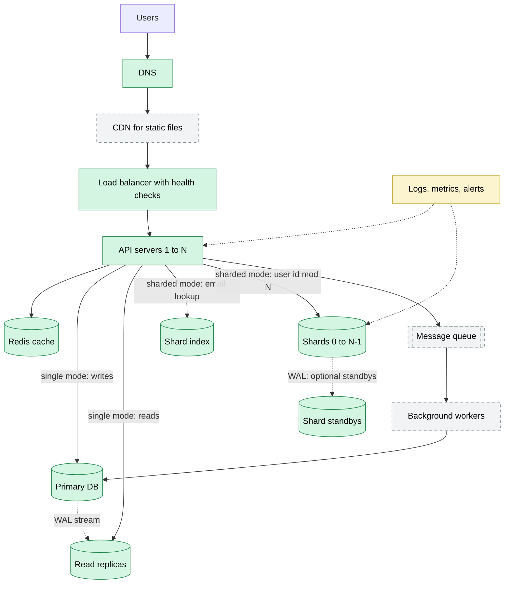
```mermaid
flowchart TB
    U["Users"] --> DNS["DNS"]
    DNS --> CDN["CDN for static files"]
    CDN --> LB["Load balancer with health checks"]
    LB --> API["API servers 1 to N"]
    API --> C[("Redis cache")]
    API -->|"single mode: writes"| W[("Primary DB")]
    API -->|"single mode: reads"| R[("Read replicas")]
    W -.->|"WAL stream"| R
    API -->|"sharded mode: email lookup"| IDX[("Shard index")]
    API -->|"sharded mode: user id mod N"| SH[("Shards 0 to N-1")]
    SH -.->|"WAL: optional standbys"| STB[("Shard standbys")]
    API --> Q[["Message queue"]]
    Q --> WK["Background workers"]
    WK --> W
    OBS["Logs, metrics, alerts"] -.-> API
    OBS -.-> SH

    classDef built fill:#d5f5e3,stroke:#1e8449,color:#000
    classDef partial fill:#fcf3cf,stroke:#b7950b,color:#000
    classDef missing fill:#f2f3f4,stroke:#7f8c8d,stroke-dasharray:5 5,color:#000
    class DNS,LB,API,C,W,R,IDX,SH,STB built
    class OBS partial
    class CDN,Q,WK missing
```

| Box | Status | Note |
|---|---|---|
| DNS, load balancer, API servers, Redis | ✅ | Guide B |
| Primary plus read replicas (**single mode**) | ✅ | Guide B |
| Shards plus a shard index, optional standbys (**sharded mode**) | ✅ | Guide B sharding add-on. You pick one data-tier mode with `enable_single_db` and `shard_count` |
| Logs, metrics, alerts | amber | DigitalOcean monitoring graphs and `docker logs` only. No alerts, no central log search |
| CDN | ❌ | The API serves JSON only, so there are no static files to offload |
| Queue and workers | ❌ | A todo list has no slow background jobs |

## 2. Symptom to fix cheat sheet

| What you observe | Likely bottleneck | Fix | Rung | In our build |
|---|---|---|---|---|
| App and DB fight for the same RAM and CPU | Shared box | Separate servers | 2 | ✅ |
| One server maxed out, or its failure takes the site down | Single app server | Load balancer plus several servers | 3 | ✅ |
| DB CPU high, mostly `SELECT`s | Read volume | Read replicas | 4 | ✅ |
| Same rows fetched repeatedly | Repeated work | Cache | 5 | ✅ |
| Slow static files for faraway users | Distance and origin load | CDN | 6 | ❌ |
| Login breaks when requests hit another server | State inside servers | Stateless app tier | 7 | ✅ |
| Slow request caused by heavy work (resize, email, report) | Work done inline | Queue plus workers | 8 | ❌ |
| Regional outage, or high latency abroad | One location | Multiple regions | 9 | ❌ |
| Primary DB can't keep up with **writes** or disk | Single writer | Shard | 10 | ✅ add-on |
| "We found out from customers" | No visibility | Logs, metrics, alerts, automation | 11 | partial |
| Too many DB connections as servers multiply | Connection limit | Connection pooler | atlas D | ❌ |
| A slow dependency drags everything down | No isolation | Timeouts, circuit breaker | atlas H | ❌ |
| A burst of abusive traffic | No limits | Rate limiting, WAF | atlas B, J | 🧪 |

---

## 3. The eleven rungs

### Rung 1: Everything on one machine

**Symptom:** none yet. This is where you start. **Fix:** none needed; ship.

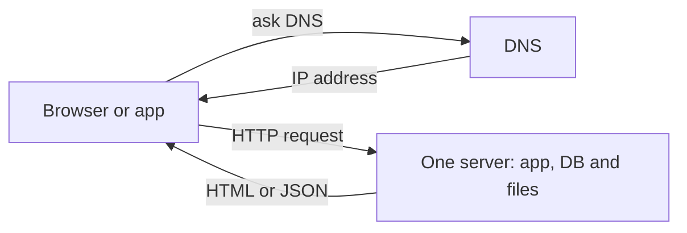
```mermaid
flowchart LR
    B["Browser or app"] -->|"ask DNS"| D["DNS"]
    D -->|"IP address"| B
    B -->|"HTTP request"| S["One server: app, DB and files"]
    S -->|"HTML or JSON"| B
```

DNS turns a name into an IP, then the client talks HTTP straight to that machine. Fine for hundreds to low thousands of users. **Trade-off:** one failure kills everything, and nothing scales separately.

**In our build:** ✅ Guide A, Stage 1. Guide B jumps straight to the final layout.

### Rung 2: Split the app from the database

**Symptom:** web processes and the database compete for resources. **Fix:** two servers on a private network.

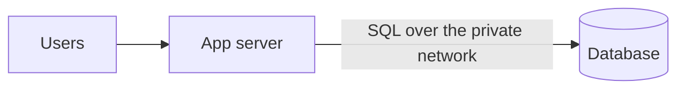
```mermaid
flowchart LR
    U["Users"] --> W["App server"]
    W -->|"SQL over the private network"| D[("Database")]
```

Each tier is sized and secured on its own, and the database is never public.

| | Relational (PostgreSQL, MySQL) | Non-relational (key-value, document, column, graph) |
|---|---|---|
| Strengths | Joins, transactions, mature tooling | Horizontal scale, flexible shape, very low latency |
| Pick when | Structured data with relationships (the default) | Huge volume, simple access by key, schemaless blobs |

**In our build:** ✅ PostgreSQL on its own droplets, reachable only inside the VPC.

### Rung 3: More than one app server, behind a load balancer

**Symptom:** one server is saturated, or its failure means an outage. Two ways to add capacity:

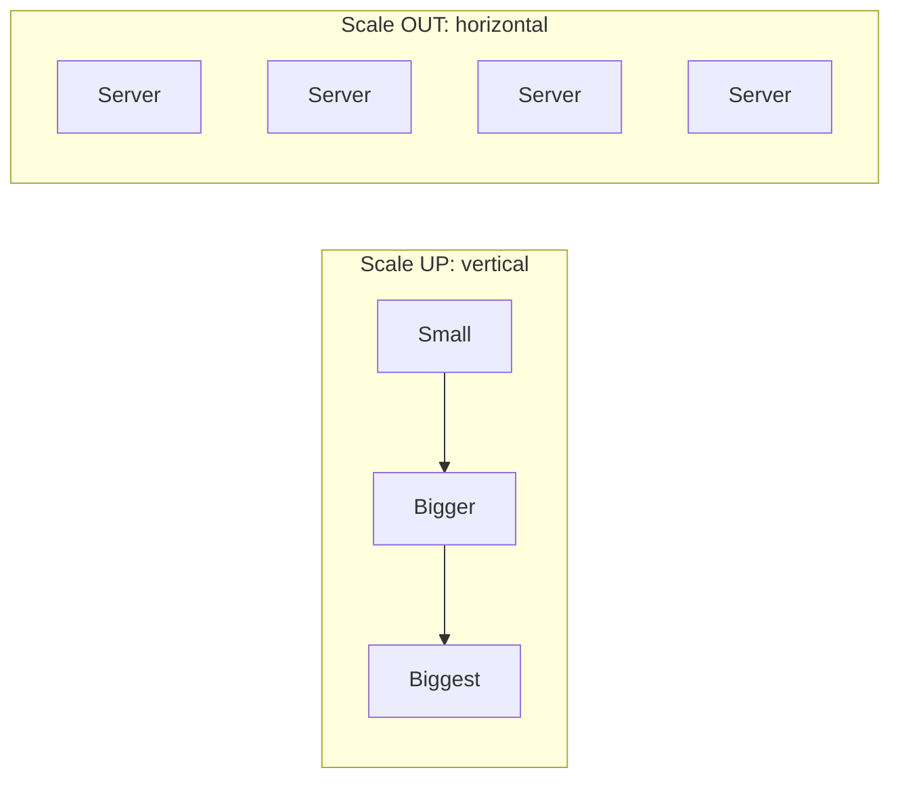
```mermaid
flowchart LR
    subgraph UP["Scale UP: vertical"]
        S1["Small"] --> S2["Bigger"] --> S3["Biggest"]
    end
    subgraph OUT["Scale OUT: horizontal"]
        X1["Server"]
        X2["Server"]
        X3["Server"]
        X4["Server"]
    end
```

Scaling up is simplest and works early, but it has a ceiling, costs more per unit and leaves one point of failure. **Scaling out** needs a way to share requests:

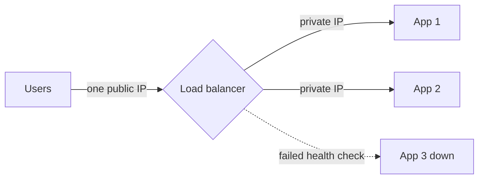
```mermaid
flowchart LR
    U["Users"] -->|"one public IP"| LB{"Load balancer"}
    LB -->|"private IP"| A["App 1"]
    LB -->|"private IP"| B["App 2"]
    LB -.->|"failed health check"| C["App 3 down"]
```

The balancer owns the public address, probes each server and skips dead ones. Servers talk to it over private IPs, so users never reach them directly.

**In our build:** ✅ DigitalOcean load balancer, tag-based membership, `/healthz` checks, `api_count` to scale out. 🧪 Algorithms and failure behaviour practised with Nginx in Guide C section 2.7.

### Rung 4: Read replicas

**Symptom:** the database is busy and most of its work is reads. **Fix:** copies of the data serve reads while one primary takes all writes.

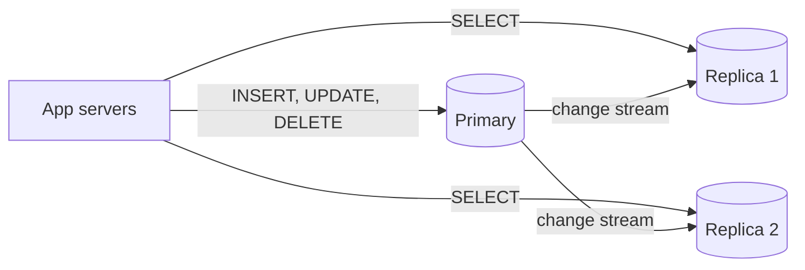
```mermaid
flowchart LR
    APP["App servers"] -->|"INSERT, UPDATE, DELETE"| P[("Primary")]
    APP -->|"SELECT"| R1[("Replica 1")]
    APP -->|"SELECT"| R2[("Replica 2")]
    P -->|"change stream"| R1
    P -->|"change stream"| R2
```

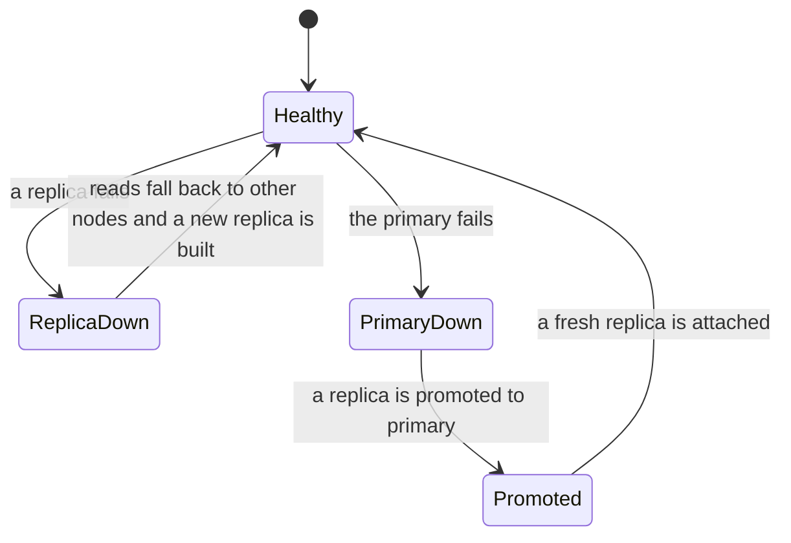
```mermaid
stateDiagram-v2
    [*] --> Healthy
    Healthy --> ReplicaDown : a replica fails
    ReplicaDown --> Healthy : reads fall back to other nodes and a new replica is built
    Healthy --> PrimaryDown : the primary fails
    PrimaryDown --> Promoted : a replica is promoted to primary
    Promoted --> Healthy : a fresh replica is attached
```

Benefits: more read throughput, copies in more than one place, and a spare to promote. **Trade-offs:** replicas lag slightly (stale reads right after a write), promotion needs care because the chosen replica may miss the last few writes, and writes are still limited to one machine.

**In our build:** ✅ Two streaming replicas (WAL), the app picks a random replica for reads, login and `?fresh=1` use the primary. ❌ Failover is **manual** (a runbook in Guide B section 10). 🧪 Lag and promotion practised in Guide C section 5.

### Rung 5: Cache

**Symptom:** the same expensive queries run again and again. **Fix:** keep recent results in memory next to the app.

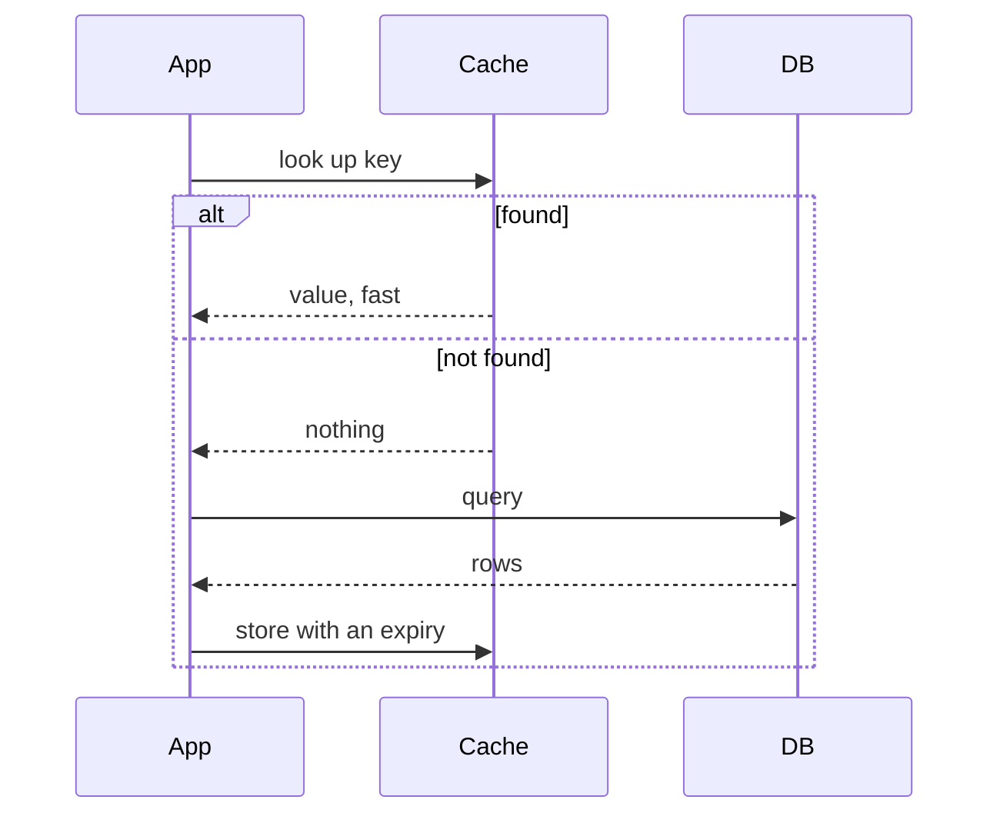
```mermaid
sequenceDiagram
    participant App
    participant Cache
    participant DB
    App->>Cache: look up key
    alt found
        Cache-->>App: value, fast
    else not found
        Cache-->>App: nothing
        App->>DB: query
        DB-->>App: rows
        App->>Cache: store with an expiry
    end
```

Checklist before adding one:

- **Fits?** Best for data read often and changed rarely. A cache is volatile memory, never the only copy of anything important.
- **Expiry:** too short and you barely help the DB, too long and users see stale data.
- **Consistency:** DB and cache are updated separately and can disagree, so delete the cached key whenever you change the row.
- **Failure:** one cache node is a single point of failure. Make the app work, slowly, without it.
- **Eviction when full:** least-recently-used is the usual default.

**In our build:** ✅ Redis cache-aside per user, 30 s TTL plus delete-on-write, LRU eviction, falls through to the DB if Redis is down. ❌ Redis is a single node. 🧪 Stampede lock and TTL jitter exist only in the Guide C demo, not in the API code.

### Rung 6: CDN for static files

**Symptom:** images, scripts and styles load slowly for faraway users and burden your servers. **Fix:** edge servers that keep copies near users.

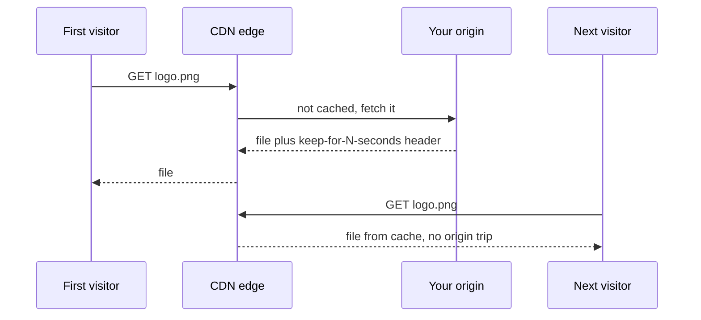
```mermaid
sequenceDiagram
    participant U1 as First visitor
    participant Edge as CDN edge
    participant O as Your origin
    participant U2 as Next visitor
    U1->>Edge: GET logo.png
    Edge->>O: not cached, fetch it
    O-->>Edge: file plus keep-for-N-seconds header
    Edge-->>U1: file
    U2->>Edge: GET logo.png
    Edge-->>U2: file from cache, no origin trip
```

Practical points: the CDN bills for traffic, so skip rarely used files. Pick cache lifetimes carefully. Plan a fallback to the origin if the CDN has an outage. To replace a file early, call the provider's purge API or change its URL (`logo.png?v=2`).

**In our build:** ❌ Not needed: the API returns JSON. You would add it for user uploads or a web front end (see section 6).

### Rung 7: Make the app tier stateless

**Symptom:** a user is logged in on server A, but the next request hits B and they look logged out. **Cause:** session data lives in one server's memory.

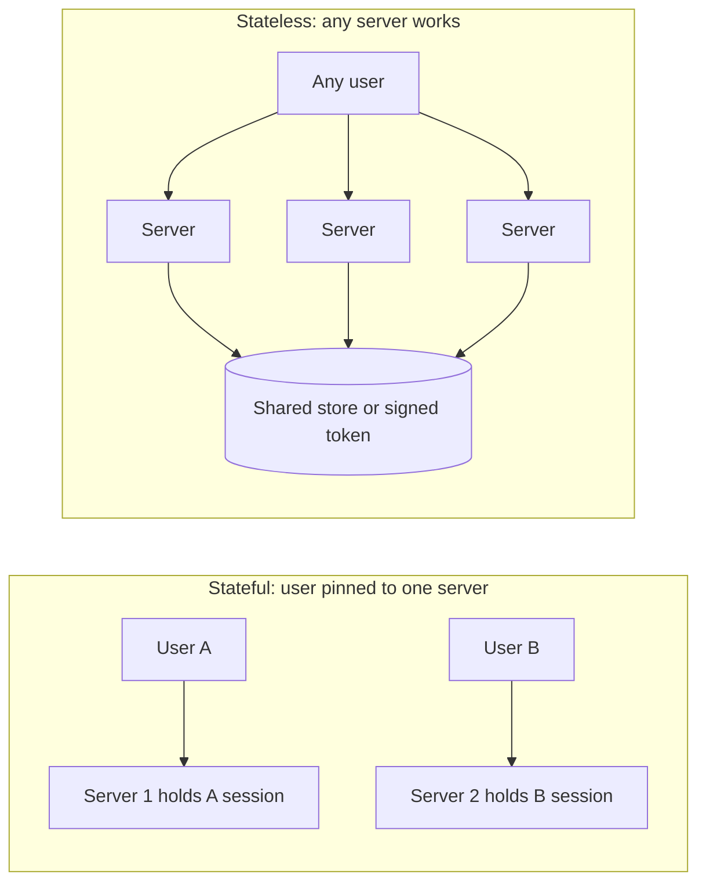
```mermaid
flowchart LR
    subgraph BAD["Stateful: user pinned to one server"]
        U1["User A"] --> S1["Server 1 holds A session"]
        U2["User B"] --> S2["Server 2 holds B session"]
    end
    subgraph GOOD["Stateless: any server works"]
        U3["Any user"] --> X1["Server"]
        U3 --> X2["Server"]
        U3 --> X3["Server"]
        X1 --> SH[("Shared store or signed token")]
        X2 --> SH
        X3 --> SH
    end
```

Sticky sessions can paper over the problem but make scaling and failure handling harder. The clean fix is a shared store (database, Redis) or a signed token the client carries (a JWT). Once state is gone, servers are interchangeable, so you can **autoscale**.

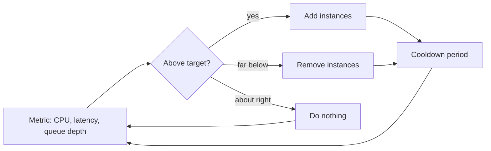
```mermaid
flowchart LR
    M["Metric: CPU, latency, queue depth"] --> D{"Above target?"}
    D -->|"yes"| UP2["Add instances"]
    D -->|"far below"| DOWN["Remove instances"]
    D -->|"about right"| W["Do nothing"]
    UP2 --> COOL["Cooldown period"]
    DOWN --> COOL
    COOL --> M
    W --> M
```

**In our build:** ✅ JWT, any API server can serve any request, identical `JWT_SECRET_KEY` everywhere. 🔧 Autoscaling exists only in Part 2 (Kubernetes HPA plus node autoscaling). On droplets you change `api_count` by hand.

### Rung 8: Queues and background workers

**Symptom:** some requests do slow work (resizing photos, sending email, building reports) and users wait, or the work is lost when a server dies. **Fix:** record the job, reply immediately, let separate workers do it.

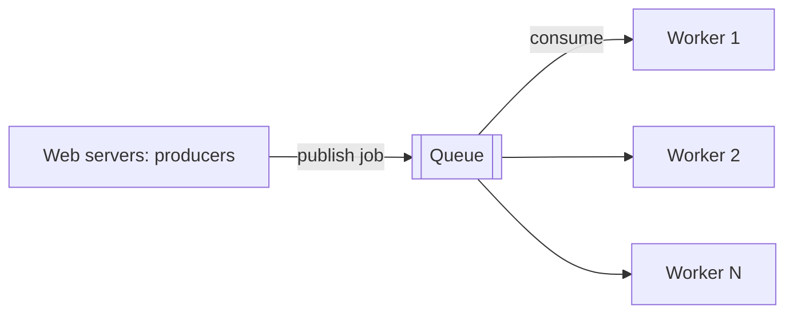
```mermaid
flowchart LR
    API["Web servers: producers"] -->|"publish job"| Q[["Queue"]]
    Q -->|"consume"| W1["Worker 1"]
    Q --> W2["Worker 2"]
    Q --> W3["Worker N"]
```

Producers and consumers are decoupled: either side can be down or slow without breaking the other, and each scales on its own. Rule of thumb: queue growing means add workers, queue always empty means remove some.

**In our build:** ❌ The Todo API has no background work. The earlier CodeBox guide used RabbitMQ for code execution jobs, and we dropped it for the Postgres-only Todo app.

### Rung 9: More than one data center or region

**Symptom:** a regional outage takes you offline, or users on another continent see high latency. **Fix:** run the stack in several locations and steer users with location-aware DNS.

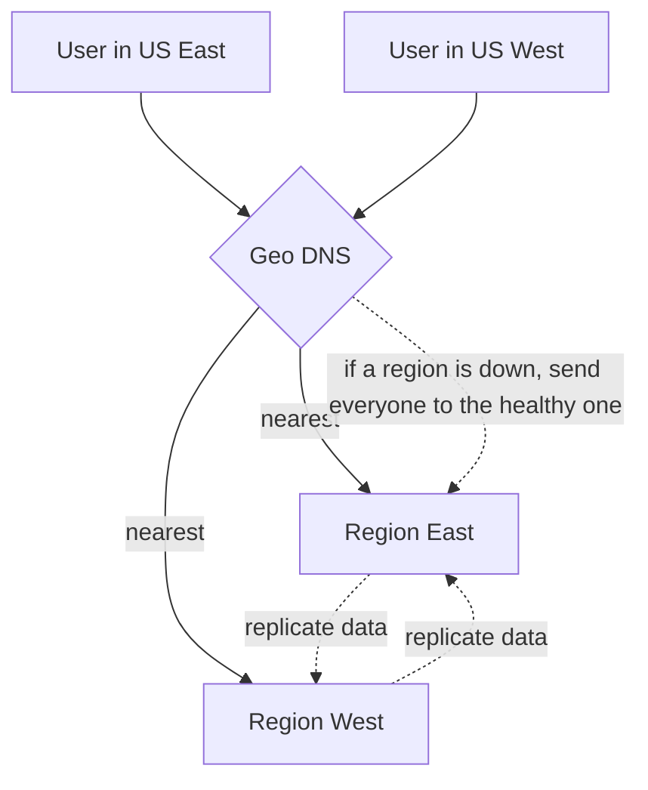
```mermaid
flowchart TB
    U1["User in US East"] --> G{"Geo DNS"}
    U2["User in US West"] --> G
    G -->|"nearest"| E["Region East"]
    G -->|"nearest"| W["Region West"]
    E -.->|"replicate data"| W
    W -.->|"replicate data"| E
    G -.->|"if a region is down, send everyone to the healthy one"| E
```

New problems: **routing** (send users to the right place and fail over), **data** (keep regions in sync, usually asynchronously, and decide how conflicts resolve) and **operations** (test and deploy to every region identically).

**In our build:** ❌ Single region (`blr1`).

### Rung 10: Shard the database

**Symptom:** one primary can't absorb the write volume or data size and vertical scaling is exhausted. **Fix:** split rows across several databases by a **shard key**.

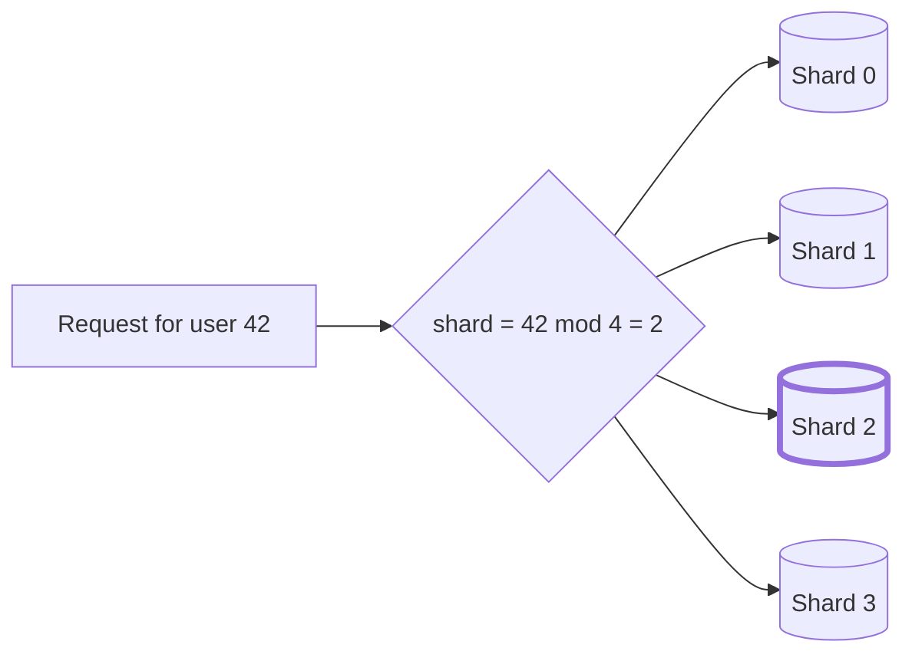
```mermaid
flowchart LR
    R["Request for user 42"] --> F{"shard = 42 mod 4 = 2"}
    F --> S0[("Shard 0")]
    F --> S1[("Shard 1")]
    F --> S2[("Shard 2")]
    F --> S3[("Shard 3")]
    style S2 stroke-width:4px
```

The shard key matters most: it should spread data and traffic evenly and match your common queries (for a todo app, `user_id`). Costs:

- **Resharding:** changing the shard count moves lots of data. Consistent hashing, or many small logical shards from day one, reduce the pain.
- **Hot spots:** one very busy customer can overload their shard.
- **Cross-shard work:** joins and transactions across shards are hard, so denormalize.

**In our build:** ✅ Implemented in the Guide B sharding add-on (Section 11), and earlier by hand in Guide A. 🧪 Modulo versus consistent-hashing movement (75 percent versus 25 percent) is shown in Guide C section 6.

How a request flows once the platform runs in sharded mode:

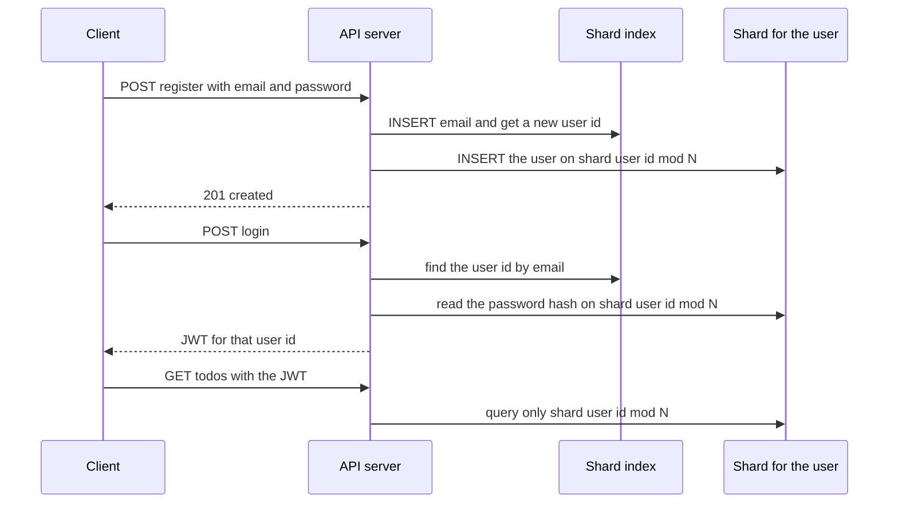
```mermaid
sequenceDiagram
    participant C as Client
    participant A as API server
    participant I as Shard index
    participant S as Shard for the user
    C->>A: POST register with email and password
    A->>I: INSERT email and get a new user id
    A->>S: INSERT the user on shard user id mod N
    A-->>C: 201 created
    C->>A: POST login
    A->>I: find the user id by email
    A->>S: read the password hash on shard user id mod N
    A-->>C: JWT for that user id
    C->>A: GET todos with the JWT
    A->>S: query only shard user id mod N
```

What exists for it:

| Piece | Where | What it does |
|---|---|---|
| Shard servers | `infra/shards.tf` (`shard_count` droplets) | One Docker PostgreSQL per shard (`todo_shard0`, `todo_shard1`, ...). The droplet index is the shard number |
| Shard index | `todo-shard-index`, database `todo_index` | Maps email to user id and hands out globally unique ids, so shards never collide |
| Optional standbys | `shard_standbys = true` | One streaming replica per shard and for the index, for faster manual failover |
| Routing rule | `db.py`: `user_id % number_of_shards` | Everything a user owns lives on one shard |
| Two data-tier modes | `enable_single_db`, `shard_count` | Single primary plus replicas, or shards, chosen in `terraform.tfvars` |
| Mode-aware deploy | `MODE=sharded deploy/deploy.sh` | Writes `SHARD_URLS` and `SHARD_INDEX_URL` into each server's environment |
| Data migration | `migrate_to_shards.py` and `deploy/migrate-to-shards.sh` | Moves existing users and todos into the shards during a maintenance window |
| Safety guard | `deploy/SHARD_COUNT` | Refuses a deploy if the shard count changed, because that silently misroutes users |
| Verification | `deploy/shard-check.sh` | Counts rows per shard and checks that nobody is on the wrong shard |

Trade-offs we accepted, so you can see them in practice: no cross-shard joins (global counts need a scatter-gather), the shard index is a critical small server, the shard count is effectively permanent (modulo hashing), and each shard is its own failure domain. We chose modulo rather than consistent hashing for simplicity, so the advice is to start with more shards than you need and scale by resizing.

### Rung 11: See what is happening, automate what repeats

**Symptom:** you learn about problems from users and deploys are scary. **Fix:**

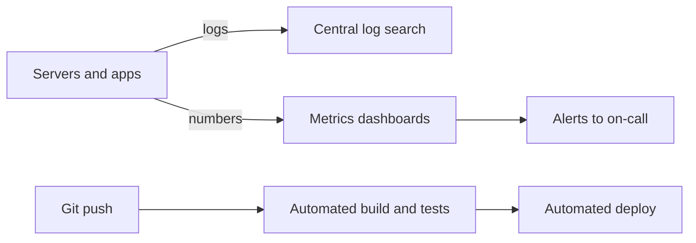
```mermaid
flowchart LR
    S["Servers and apps"] -->|"logs"| L["Central log search"]
    S -->|"numbers"| M["Metrics dashboards"]
    M --> A["Alerts to on-call"]
    G["Git push"] --> CI["Automated build and tests"]
    CI --> CD["Automated deploy"]
```

Track three layers of metrics: **machine** (CPU, memory, disk), **tier** (DB latency, cache hit rate, queue depth) and **business** (daily users, sign-ups, revenue). Automate build, test and deploy so every change is verified and consistent.

**In our build:** partial. ✅ Infrastructure as code (Terraform), scripted rolling deploys, health endpoints, DigitalOcean monitoring graphs, load test with `hey`. ❌ No alerts, no central logs, no tracing, no CI pipeline.

---

## 4. Concept atlas: every scaling concept

One map, then a table per area. Each row says what the concept is and whether we built it.

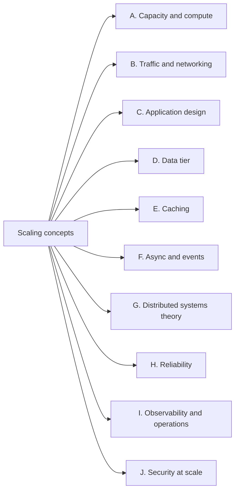
```mermaid
flowchart LR
    ROOT["Scaling concepts"] --> A["A. Capacity and compute"]
    ROOT --> B["B. Traffic and networking"]
    ROOT --> C["C. Application design"]
    ROOT --> D["D. Data tier"]
    ROOT --> E["E. Caching"]
    ROOT --> F["F. Async and events"]
    ROOT --> G["G. Distributed systems theory"]
    ROOT --> H["H. Reliability"]
    ROOT --> I["I. Observability and operations"]
    ROOT --> J["J. Security at scale"]
```

### A. Capacity and compute

| Concept | In one line | Status |
|---|---|---|
| Vertical scaling | Make one machine bigger | ✅ change `api_size` or `db_size` |
| Horizontal scaling | Add more machines | ✅ `api_count`, `replica_count` |
| Autoscaling | Add or remove capacity from metrics | 🔧 Kubernetes HPA (Part 2) |
| Headroom and over-provisioning | Spare capacity for spikes and failures | ✅ sized with redundancy |
| Capacity planning and load testing | Estimate, then prove with a test | ✅ `hey` in Guide B section 9 |
| Right-sizing and cost control | Match size to real usage | partial: cost table only |
| Containers | Package the app and its dependencies | ✅ Docker |
| Orchestration | Scheduler that runs and heals containers | 🔧 Kubernetes (DOKS) |
| Serverless (functions) | Pay per request, no servers to manage | ❌ |

### B. Traffic and networking

| Concept | In one line | Status |
|---|---|---|
| DNS and TTL | Names to IPs, cached for a set time | ✅ implicit; optional A record |
| Geo DNS | Resolve to the nearest region | ❌ |
| Load balancer (L4 or L7) | Spread requests, remove dead servers | ✅ L7 HTTP; 🧪 algorithms in Guide C |
| Health checks | Probe servers so bad ones leave rotation | ✅ `/healthz`, `/readyz` |
| Sticky sessions | Pin a client to one server | 🧪 explained, deliberately avoided |
| TLS termination | Decrypt HTTPS at the edge | 🔧 optional via `domain` variable |
| Connection draining | Finish in-flight requests before removing a server | partial: rolling deploy waits between servers |
| Reverse proxy | Front server that forwards to apps | 🧪 Nginx demo |
| CDN and edge caching | Static content served near users | ❌ |
| API gateway | Auth, quotas, routing for many services | ❌ not needed for one service |
| Service discovery and mesh | Services find and secure each other | ❌ |
| VPC, subnets, NAT, bastion | Private network zones | ✅ VPC; subnets ❌ on DigitalOcean (🧪 Docker demo) |
| Cloud firewalls | Allow-lists by port and source | ✅ tag-based |
| HTTP keep-alive, HTTP/2, compression | Cheaper connections, smaller payloads | partial: gunicorn defaults |

### C. Application design

| Concept | In one line | Status |
|---|---|---|
| Stateless services | No per-user memory on the server | ✅ JWT |
| Idempotency | Repeating a request has no extra effect | ❌ |
| Pagination and cursors | Never return unbounded lists | partial: fixed `LIMIT 200` |
| Rate limiting | Cap requests per client | 🧪 Nginx snippet only |
| Load shedding and backpressure | Refuse work when overloaded | ❌ |
| Graceful degradation | Keep core features when a part fails | ✅ cache failure falls through to the DB |
| Timeouts, retries, backoff and jitter | Bound waiting, retry politely | partial: gunicorn and Redis timeouts |
| Circuit breaker and bulkhead | Stop calling a failing dependency, isolate pools | ❌ |
| Feature flags | Turn features on or off without a deploy | ❌ |

### D. Data tier

| Concept | In one line | Status |
|---|---|---|
| Indexing and query tuning | The cheapest speed-up (indexes, `EXPLAIN`, N+1) | ✅ index on `todos(user_id)` |
| Connection pooling | Share few DB connections among many workers | partial: per-worker pools, ❌ no PgBouncer. Sharding multiplies connections: each worker holds one per shard plus the index |
| Single-leader replication | One writer, many readers | ✅ read replicas, and optional standbys per shard |
| Multi-leader and leaderless replication | Many writers, conflict handling | ❌ |
| Read/write splitting | Route reads to replicas | ✅ `db.py` |
| Replication lag and read-your-writes | Replicas are slightly behind | ✅ login on primary, `?fresh=1` |
| Synchronous versus asynchronous replication | Wait for replicas or not | ✅ async (default); 🧪 explained |
| Failover | Promote a replica when the primary dies | ❌ manual for the primary, each shard and the index (standbys help); 🔧 automatic with managed DB |
| Table partitioning | Split one table inside one server | 🧪 |
| Sharding and routing | Split data across servers by key | ✅ `user_id % N` (add-on: `shards.tf`, `db.py`, `MODE=sharded`) |
| Shard index (directory lookup) | A small database mapping email to user and giving out unique ids | ✅ `todo-shard-index` |
| Consistent hashing | Add nodes while moving few keys | 🧪 demo only. We use modulo with a fixed count |
| Resharding | Changing the number of shards | partial: ✅ one-time migration script, ❌ live resharding, and a guard blocks accidental count changes |
| Logical shards | Many small shards that can later move to other servers | 🧪 advice only: start with a larger `shard_count` |
| Scatter-gather queries | Ask every shard and combine the answers | ✅ `deploy/shard-check.sh` does it for row counts |
| Hot keys and hot shards | One key or tenant overloads one node | 🧪 explained, no mitigation built |
| Denormalization and materialized views | Precompute joins and aggregates | ❌ |
| OLTP versus OLAP, CQRS | Separate transaction, reporting and read models | ❌ |
| Polyglot persistence | Right store per workload (document, search, time-series, graph) | ❌ |
| Object storage | Files and blobs outside the database | ❌ (Spaces would fit) |
| ID generation | UUID, ULID, Snowflake, central allocator | ✅ the shard index allocates unique user ids |
| Backups and point-in-time recovery | Restore to a chosen moment | partial: nightly `pg_dump` per database (single, each shard, the index) plus droplet backups, ❌ PITR |
| Disaster recovery (RPO and RTO) | How much data and time you can afford to lose | ❌ |

### E. Caching

| Concept | In one line | Status |
|---|---|---|
| Cache layers | Browser, CDN, app, Redis, DB buffer | ✅ Redis; DB buffer automatic |
| Cache-aside | App fills the cache on a miss | ✅ |
| Read-through, write-through, write-behind | Cache-managed loading and writing | 🧪 explained |
| Expiry (TTL) and delete-on-write | Two ways to keep data fresh | ✅ both |
| Eviction (LRU, LFU) | What to drop when full | ✅ LRU |
| Stampede, avalanche, penetration | Hot key expiry, synchronized expiry, misses for absent data | 🧪 locks and jitter in Guide C only |
| Cache warming | Preload hot data | ❌ |
| Distributed cache and failure handling | Multiple cache nodes, no single point of failure | ❌ single Redis node |
| HTTP caching headers | `Cache-Control` for public data | ❌ |

### F. Async and event-driven

| Concept | In one line | Status |
|---|---|---|
| Message queue and workers | Buffer jobs, scale consumers | ❌ |
| Pub/sub | One event, many subscribers | ❌ |
| Event streaming log | Replayable ordered event history | ❌ |
| Delivery guarantees | At-most, at-least, exactly-once (with idempotency) | ❌ |
| Dead-letter queue and retries | Park jobs that keep failing | ❌ |
| Outbox pattern and sagas | Reliable events and multi-step workflows | ❌ |
| Scheduled and batch jobs | Cron-style work | partial: nightly backup cron |

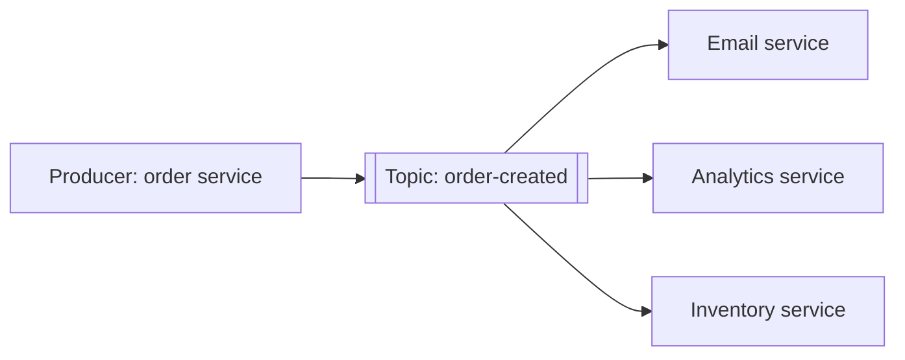
```mermaid
flowchart LR
    P["Producer: order service"] --> T[["Topic: order-created"]]
    T --> S1["Email service"]
    T --> S2["Analytics service"]
    T --> S3["Inventory service"]
```

### G. Distributed systems theory

| Concept | In one line | Status |
|---|---|---|
| CAP and PACELC | During a network split pick consistency or availability, otherwise trade latency for consistency | 🧪 reasoning only |
| Consistency models | Strong, read-your-writes, eventual | ✅ eventual reads on replicas, strong on primary |
| Consensus (Raft, Paxos) and leader election | Nodes agree on one leader | ❌ (managed DBs and Patroni use it) |
| Quorums | Majority agreement for reads and writes | ❌ |
| Two-phase commit | Atomic commit across nodes, slow | ❌ avoided |
| Clocks and ordering | No single clock across machines | ❌ |
| Split brain | Two nodes both think they are the leader | ❌ a risk of manual failover |

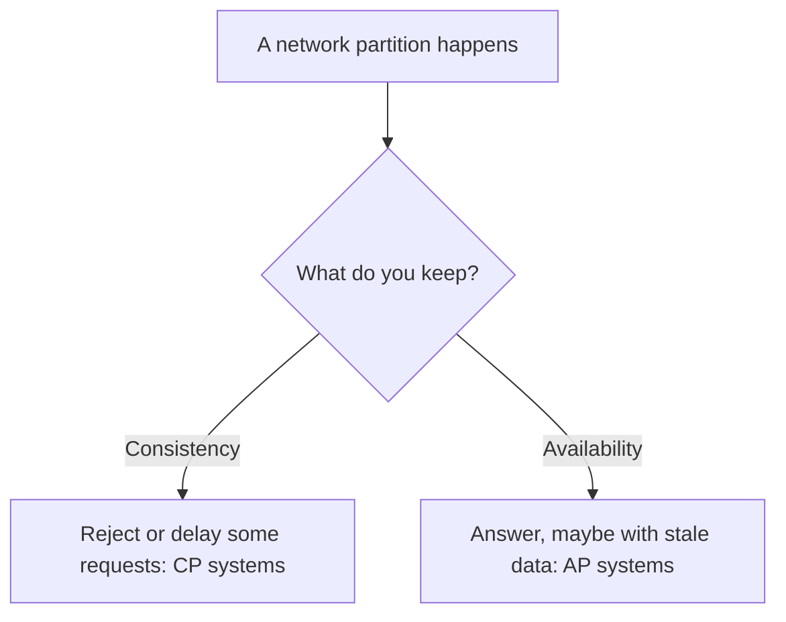
```mermaid
flowchart TB
    P["A network partition happens"] --> C{"What do you keep?"}
    C -->|"Consistency"| CP["Reject or delay some requests: CP systems"]
    C -->|"Availability"| AP["Answer, maybe with stale data: AP systems"]
```

### H. Reliability and resilience

| Concept | In one line | Status |
|---|---|---|
| Redundancy and no single point of failure | Two or more of everything critical | ✅ app servers, replicas or shard standbys, managed LB; ❌ Redis, a shard without a standby, the shard index without a standby |
| Active-passive versus active-active | Standby waits, or all nodes serve | ✅ replicas are active for reads |
| Multi-AZ and multi-region | Survive a data center or region loss | ❌ |
| SLI, SLO and error budget | Measurable reliability targets | ❌ |
| Chaos engineering and failure drills | Break things on purpose | 🧪 killing a server in Guide A step 40 and Guide C section 2.7 |
| Runbooks | Written steps for known failures | ✅ failover and restore in Guide B section 10 |
| Circuit breaker | Fail fast when a dependency is sick | ❌ |

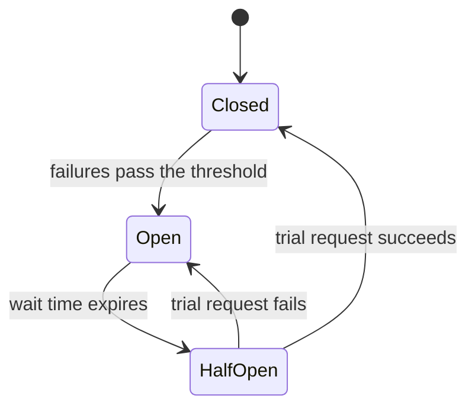
```mermaid
stateDiagram-v2
    [*] --> Closed
    Closed --> Open : failures pass the threshold
    Open --> HalfOpen : wait time expires
    HalfOpen --> Closed : trial request succeeds
    HalfOpen --> Open : trial request fails
```

### I. Observability and operations

| Concept | In one line | Status |
|---|---|---|
| Logs, metrics, traces | What happened, how much, where time went | partial: `docker logs` and DO graphs, ❌ traces |
| Alerting and dashboards | Be told before users are | ❌ |
| Infrastructure as code | Servers defined in files | ✅ Terraform |
| Immutable and reproducible servers | Rebuild from a script, don't hand-edit | ✅ cloud-init plus Docker |
| CI/CD | Automatic build, test, deploy | ❌ manual `deploy.sh` |
| Rolling deploys | Replace servers one at a time | ✅ |
| Blue/green and canary | Switch whole versions, or send a small share first | ❌ |
| Secrets management | Rotate and store credentials safely | partial: generated by Terraform, kept in state |
| Remote state and locking | Shared safe Terraform state | 🔧 optional Spaces backend |
| Database migrations | Versioned schema changes | ❌ manual |

```mermaid
flowchart LR
    S["Your services"] --> L["Logs: what happened"]
    S --> M["Metrics: how much and how fast"]
    S --> T["Traces: where time went"]
    L --> A["Alerts and dashboards"]
    M --> A
    T --> A
    A --> O["On-call and SLO review"]
```

```mermaid
flowchart LR
    U["Users"] --> R{"Router or load balancer"}
    R -->|"all traffic"| B["Blue: version 1"]
    R -.->|"no traffic until the switch"| G["Green: version 2"]
    R -.->|"canary: a small share"| C["Canary: version 2"]
```

### J. Security at scale

| Concept | In one line | Status |
|---|---|---|
| Least privilege | App DB role owns only its database | ✅ |
| Network isolation | DB and Redis reachable only inside the VPC | ✅ |
| TLS in transit | Encrypt traffic | 🔧 at the LB with a domain |
| Rate limits and abuse control | Stop floods and scraping | 🧪 |
| WAF and DDoS protection | Filter malicious traffic at the edge | ❌ |
| Audit logs and secret rotation | Know who did what, replace old credentials | ❌ |

### One more picture: connection pooling

Every app worker holds database connections, and databases cap them. A pooler multiplexes many clients onto few real connections.

```mermaid
flowchart LR
    subgraph APPS["Many app workers"]
        A1["Worker"]
        A2["Worker"]
        A3["Worker"]
        A4["Worker"]
    end
    A1 --> P["Pooler such as PgBouncer"]
    A2 --> P
    A3 --> P
    A4 --> P
    P -->|"few real connections"| DB[("PostgreSQL")]
```

---

## 5. What we implemented

### 5.1 In the deployed platform (Guide B)

```mermaid
flowchart TB
    subgraph BUILT["Built and deployed by Terraform plus Docker"]
        LB["Load balancer with health checks"]
        API["Stateless API servers in Docker"]
        RD[("Redis cache")]
        FW["Tag-based firewalls and a private VPC"]
        IAC["Terraform, cloud-init, deploy script"]
    end
    subgraph SINGLE["Data tier, single mode"]
        PG[("PostgreSQL primary")]
        RP[("2 streaming read replicas")]
    end
    subgraph SHARDED["Data tier, sharded mode: the add-on"]
        IDX[("Shard index")]
        SH[("N shards")]
        SB[("Optional standbys")]
    end
    subgraph OPT["Optional: code exists, switched off"]
        K8S["Kubernetes with HPA"]
        MAN["Managed PostgreSQL and Valkey"]
        TLS["HTTPS via domain variable"]
    end
    LB --> API
    API --> RD
    API --> PG
    API --> RP
    PG -.->|"WAL"| RP
    API --> IDX
    API --> SH
    SH -.->|"WAL"| SB
```

### 5.2 Status summary by area

| Area | ✅ Built | 🔧 Optional | 🧪 Local demo only | ❌ Not built |
|---|---|---|---|---|
| Compute | Horizontal and vertical scaling, containers, rolling deploys | Kubernetes, HPA | | Serverless |
| Traffic | Load balancer, health checks, firewalls, VPC | HTTPS | LB algorithms, subnets, rate limit | CDN, gateway, geo DNS |
| Data | Primary plus 2 replicas, read/write split, indexes, backups, **sharding with a shard index, standbys, migration and a count guard (add-on)** | Managed DB | Partitioning, consistent hashing, promotion | Auto failover, pooler, PITR, search, object storage, live resharding |
| Cache | Redis cache-aside, TTL, delete-on-write, LRU | Managed Valkey | Stampede lock, jitter | Redis redundancy, HTTP cache headers |
| Async | | | | Queue, workers, pub/sub, streaming |
| Reliability | Redundant app and read tier, graceful cache fallback, runbooks | | Failure drills | Circuit breaker, SLOs, multi-region |
| Operations | Terraform, cloud-init, scripted deploys, load test | Remote state | | CI/CD, blue/green, alerts, tracing, central logs |
| Security | Least-privilege DB role, private DB and cache | | | WAF, DDoS, secret rotation |

### 5.3 Where each piece lives

| Built item | File or section |
|---|---|
| VPC, tags, firewalls | `infra/network.tf` (Guide B section 4.5) |
| Registry and image pull credentials | `infra/registry.tf` |
| Primary and replicas, first-boot scripts | `infra/db.tf` (with `enable_single_db`), `scripts/pg-*.sh` |
| Shard servers, shard index, standbys | `infra/shards.tf` (sharding add-on, Section 11.2) |
| Mode-aware deploy and the shard-count guard | `deploy/deploy.sh` (`MODE=sharded`), `deploy/SHARD_COUNT` |
| Data migration into shards | `app/migrate_to_shards.py`, `deploy/migrate-to-shards.sh`, `deploy/maintenance.sh` |
| Shard verification | `deploy/shard-check.sh` |
| Redis | `infra/cache.tf`, `scripts/redis.sh` |
| API droplets and load balancer | `infra/api.tf`, `infra/lb.tf` |
| Read/write splitting, cache-aside, JWT | `db.py`, `cache.py`, `auth.py`, `todos.py` (Guide A Part A, Guide B section 6) |
| Rolling deploy, smoke test | `deploy/deploy.sh`, `deploy/smoke-test.sh` |
| Failover and restore runbooks | Guide B section 10 |

**Honest summary:** the platform now covers the core of rungs 1 to 5, 7 and 10 (separate tiers, load balancing, replicas, cache, stateless servers, and sharding) plus a solid infrastructure-as-code base. The gaps are mostly *operational maturity* (alerts, CI/CD, automatic failover, backups with point-in-time recovery) and the *workload-specific* tools (CDN, queues) that a plain todo API doesn't need.

### 5.4 Two ways to run the data tier

You choose one in `infra/terraform.tfvars`. Both use the same API image.

| | **Single mode** | **Sharded mode** |
|---|---|---|
| Variables | `enable_single_db = true`, `shard_count = 0` | `enable_single_db = false`, `shard_count = 4` (or more) |
| Servers | 1 primary plus `replica_count` read replicas | N shard servers plus a shard index, optional standbys |
| Scales | Reads (replicas, cache) | Reads and **writes** (data split by user) |
| App settings | `DATABASE_URL`, `READ_DATABASE_URL` | `SHARD_URLS`, `SHARD_INDEX_URL` |
| Deploy | `deploy/deploy.sh` | `MODE=sharded deploy/deploy.sh` |
| Weak points | Writes limited to one machine, manual failover | Shard index is critical, count is effectively permanent, no cross-shard joins, each shard is its own failure domain |
| Choose when | Almost always at first | You measured a write bottleneck, or accept the trade-offs from day one |
| Moving between them | | Migration script plus a maintenance window (add-on Section 11.6) |

---

## 6. What more could be added

Prioritised by value per effort. "How" is the concrete move in this Terraform and Docker stack.

```mermaid
flowchart TB
    subgraph P1["Priority 1: quick wins, days"]
        a1["Alerts"]
        a2["HTTPS by default"]
        a3["Rate limiting"]
        a4["CI/CD pipeline"]
        a5["DB migrations tool"]
    end
    subgraph P2["Priority 2: reliability, weeks"]
        b1["Automatic DB failover"]
        b2["PITR backups"]
        b3["Central logs, metrics, traces"]
        b4["Connection pooler"]
        b5["Redis redundancy"]
        b6["Failover for shards and the index"]
    end
    subgraph P3["Priority 3: scale features, as needed"]
        c1["Queue and workers"]
        c2["Object storage and CDN"]
        c3["Search or analytics store"]
        c4["Autoscaling"]
    end
    subgraph P4["Priority 4: global scale"]
        d1["Multi-region and geo DNS"]
        d2["WAF and DDoS"]
        d3["Live resharding"]
        d4["Service split and gateway"]
    end
    P1 --> P2
    P2 --> P3
    P3 --> P4
```

### Priority 1: quick wins

| Addition | Why | How in this stack |
|---|---|---|
| **Alerts** | Know about CPU, disk, memory and LB errors before users do | `digitalocean_monitoring_alert` resources in Terraform, email or Slack targets |
| **HTTPS by default** | JWTs and passwords must not travel in clear text | Set the `domain` variable; delegate DNS first |
| **Rate limiting** | Stops brute-force logins and abuse | Nginx `limit_req` in front of gunicorn, or Flask-Limiter backed by Redis |
| **CI/CD** | Every push is tested and deployed the same way | GitHub Actions: run tests, build and push the image, call `deploy.sh` (or `kubectl set image`) |
| **Migrations tool** | Schema changes today are manual `ALTER TABLE` | Alembic, run as a deploy step before the rollout |
| **Pagination** | `LIMIT 200` hides data and still scans widely | Cursor pagination on `(user_id, id)` |
| **Stampede protection and jitter** | Prevents a hot-key expiry from hammering the DB | Move the Guide C lock and jitter code into `cache.py` |

### Priority 2: reliability

| Addition | Why | How in this stack |
|---|---|---|
| **Automatic DB failover** | Today a human must promote a replica | Managed PostgreSQL (`digitalocean_database_cluster`, Guide B K5), or Patroni with etcd on the droplets |
| **Point-in-time recovery** | Nightly dumps lose up to a day | Managed DB, or pgBackRest or WAL-G shipping WAL to a Spaces bucket |
| **Central logs, metrics, traces** | Debug across many servers | Prometheus and Grafana, Loki, OpenTelemetry in the Flask app |
| **Connection pooler** | Connection limits bite as servers multiply | PgBouncer container beside the primary, or a managed pool |
| **Redis redundancy** | The cache is a single point of failure | Managed Valkey, or Redis with Sentinel |
| **Failover for shards and the shard index** | Promotion is manual today, and an index outage blocks every login and registration | Patroni, or managed PostgreSQL clusters per shard. Keep `shard_standbys = true` meanwhile |
| **Timeouts, retries, circuit breaker** | A slow dependency must not cascade | Explicit DB and Redis timeouts, a small breaker around the cache |
| **Secrets management** | Passwords sit in Terraform state and env files | Encrypted remote state, a secrets store, rotation routine |
| **Failure drills** | Prove the runbooks work | Scheduled "kill the primary" and "kill a replica" exercises |

### Priority 3: scale features, add when a need appears

| Addition | Trigger | How |
|---|---|---|
| **Queue and workers** | Exports, emails, reminders, imports | RabbitMQ or Redis streams, a worker container reusing the same image |
| **Object storage and CDN** | File attachments, a web front end | DigitalOcean Spaces with its CDN, pre-signed upload URLs |
| **Search** | Full-text search over todos | OpenSearch, or Postgres full-text first |
| **Analytics store** | Heavy reports slowing the primary | A dedicated replica, or a warehouse fed by change events |
| **Autoscaling** | Spiky traffic | Part 2 Kubernetes HPA, or a scheduled script around `api_count` |
| **Blue/green or canary releases** | Risky releases | Second tag and load balancer, or Kubernetes rollouts |

### Priority 4: global scale

| Addition | Trigger | Cost |
|---|---|---|
| **Multi-region and geo DNS** | Regional outage tolerance, users on other continents | Cross-region replication, data conflict decisions, doubled infrastructure |
| **Live resharding** | The shard count must grow beyond the first plan | Consistent hashing or a directory service, online data movement with no downtime. Much harder than the modulo scheme we built, so plan the count early |
| **WAF and DDoS protection** | Public, high-profile traffic | Edge provider |
| **Service split, gateway, mesh** | Many teams or services | Operational overhead, only when the organisation needs it |

---

## 7. Principles, estimation numbers, interview template, practice

### Eight principles

1. Keep the app tier **stateless**.
2. Add **redundancy** at every tier, with no single point of failure.
3. **Cache** aggressively, but plan invalidation.
4. Push static files to a **CDN**.
5. Use **queues** to decouple slow work.
6. Scale reads with **replicas**, writes with **sharding** (a last resort).
7. Spread across **regions** when availability or latency demands it.
8. **Measure everything** and automate deployment.

### Numbers worth remembering (approximate)

| Item | Rough value |
|---|---|
| Read from memory | about 100 nanoseconds |
| Random read from SSD | about 100 microseconds |
| Round trip inside one data center | about 0.5 milliseconds |
| Disk seek (spinning) | about 10 milliseconds |
| Round trip across continents | about 100 to 150 milliseconds |
| Seconds in a day | 86,400 |

| Availability target | Downtime per year |
|---|---|
| 99 percent | about 3.65 days |
| 99.9 percent | about 8.8 hours |
| 99.99 percent | about 53 minutes |
| 99.999 percent | about 5 minutes |

Requests per second is roughly daily requests divided by 86,400, then multiplied by 3 to 10 for peak. Example: 5 million requests a day is about 58 per second on average and maybe 300 at peak.

### A template for answering a "scale this system" question

```mermaid
flowchart LR
    A["Clarify: features, users, read/write ratio"] --> B["Estimate: requests per second, storage, bandwidth"]
    B --> C["Draw a simple working version"]
    C --> D["Find the first bottleneck"]
    D --> E["Apply one fix and name its trade-off"]
    E --> D
    E --> F["Cover failure, monitoring and cost"]
```