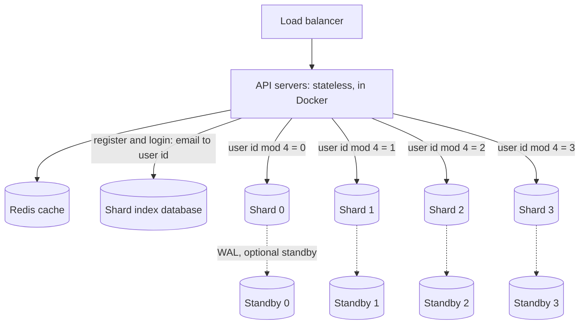
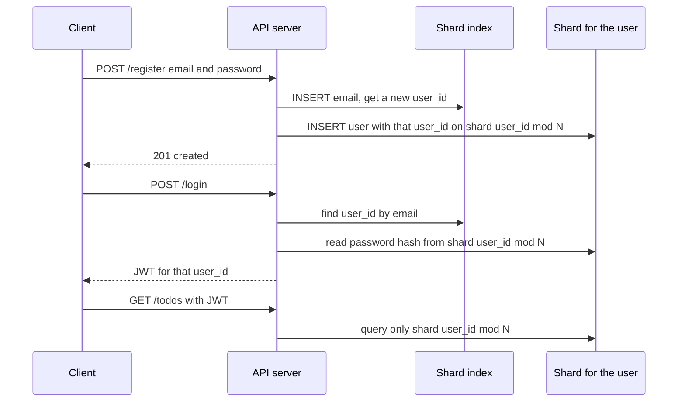
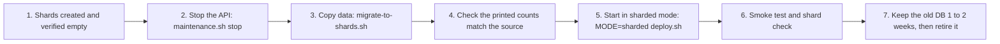

# Section 11: Add Sharding to the Terraform + Docker Platform

An add-on for `todo-terraform-docker-guide.md` (the latest version, with multi-line HCL blocks and the `chmod` lines in `pg-primary.sh`). Insert it after **Section 10 (Operating the platform)** and before **Part 2 (Kubernetes)**. Nothing in Sections 1 to 10 breaks: sharding is **off by default** (`shard_count = 0`), and every new resource is created only when you turn it on.

> **Honest framing.** Replicas and the cache already handle reads. Sharding only helps when one primary can no longer absorb the **writes** or the data size. It adds permanent complexity (no cross-shard joins, an index service, fixed shard count). Do it because you measured a write bottleneck, or because you want it from day one and accept the trade-off.

## 11.1 What you are adding



```
Request ─► API server ─► JWT says user_id = 10 ─► shard = 10 mod 4 = 2 ─► shard-2 database
                        register/login only ──► index database (email → user_id)
Every user and ALL of their todos live on ONE shard, so a normal request touches exactly one database.
```

**How the pieces fit**

| Piece | Role |
|---|---|
| **Shard key** | `user_id`. The rule is `shard = user_id % shard_count` (in `db.py`) |
| **Shards** | `todo-shard-0 … N-1`, each a Docker PostgreSQL holding database `todo_shardI` (tables `users`, `todos`) |
| **Shard index** | `todo-shard-index`, database `todo_index`, table `users_index(user_id, email)`. It hands out **globally unique user IDs** at registration (so shards never collide) and answers "which user is this email?" at login |
| **Standbys** (optional) | One hot-standby streaming replica per shard and for the index. The app does **not** read from them. They are for faster manual failover and protection against losing a server |
| **Position = shard number** | The Nth URL in `SHARD_URLS` is shard N. Order and count are **permanent** once users exist |



### Choose your path

| Your situation | Path | What you set |
|---|---|---|
| **New platform, no users yet** | **Greenfield** (11.4) | `enable_single_db = false`, `shard_count = 4` |
| **Platform running on the single primary, with data** | **Migration** (11.6) | add `shard_count = 4`, keep `enable_single_db = true` until the cutover is verified |

## 11.2 Terraform changes

### A. Add these variables to `infra/variables.tf`

```hcl
variable "enable_single_db" {
  default = true # the primary + replicas from Section 4.8. Set false once you run on shards only
}

variable "shard_count" {
  default = 0 # 0 = sharding off. Otherwise 2 or more. PERMANENT once users exist
}

variable "shard_size" {
  default = "s-2vcpu-4gb"
}

variable "shard_index_size" {
  default = "s-1vcpu-2gb"
}

variable "shard_standbys" {
  default = false # true = one hot standby per shard and for the index (doubles the database droplets)
}
```
In `infra/terraform.tfvars` (greenfield example):
```hcl
enable_single_db = false
shard_count      = 4
shard_standbys   = true      # recommended in production
```

### B. Replace `infra/db.tf` completely

Only three things change from the original: the primary and its replicas can be switched off with `enable_single_db`, the primary is addressed as `pg_primary[0]`, and a `moved` block keeps an existing primary from being destroyed and recreated.

```hcl
locals {
  pg_common_env = {
    APP_DB          = "todo"
    APP_DB_PASSWORD = random_password.app_db.result
    REPL_PASSWORD   = random_password.repl.result
    VPC_CIDR        = var.vpc_cidr
  }
  pg_primary_env = merge(local.pg_common_env, {
    PG_SUPERUSER_PASSWORD = random_password.pg_super.result
  })
  # one() returns null (instead of an error) when the primary does not exist
  pg_replica_env = merge(local.pg_common_env, {
    PRIMARY_IP = one(digitalocean_droplet.pg_primary[*].ipv4_address_private)
  })
}

# The primary used to be a single resource. Tell Terraform it is the same server, now at index [0].
# Without this, `terraform plan` would DESTROY your existing database and create a new one.
moved {
  from = digitalocean_droplet.pg_primary
  to   = digitalocean_droplet.pg_primary[0]
}

resource "digitalocean_droplet" "pg_primary" {
  count      = var.enable_single_db ? 1 : 0
  name       = "${var.project}-pg-primary"
  region     = var.region
  size       = var.db_size
  image      = var.image
  vpc_uuid   = digitalocean_vpc.main.id
  ssh_keys   = [digitalocean_ssh_key.deploy.id]
  tags       = [digitalocean_tag.db.name]
  monitoring = true
  backups    = var.db_backups

  user_data = templatefile("${path.module}/templates/cloud-init.yaml.tftpl", {
    files = {
      "/opt/bootstrap/env"        = base64encode(join("\n", [for k, v in local.pg_primary_env : "${k}=${v}"]))
      "/opt/bootstrap/run.sh"     = filebase64("${path.module}/scripts/pg-primary.sh")
      "/opt/bootstrap/pg-init.sh" = filebase64("${path.module}/scripts/pg-init.sh")
      "/opt/bootstrap/schema.sql" = filebase64("${path.module}/../app/schema.sql")
    }
  })

  lifecycle {
    ignore_changes = [user_data, image]
    # prevent_destroy = true     # uncomment in production; remove it before a deliberate removal
  }
}

resource "digitalocean_droplet" "pg_replica" {
  count      = var.enable_single_db ? var.replica_count : 0
  name       = "${var.project}-pg-replica-${count.index + 1}"
  region     = var.region
  size       = var.db_size
  image      = var.image
  vpc_uuid   = digitalocean_vpc.main.id
  ssh_keys   = [digitalocean_ssh_key.deploy.id]
  tags       = [digitalocean_tag.db.name]
  monitoring = true

  user_data = templatefile("${path.module}/templates/cloud-init.yaml.tftpl", {
    files = {
      "/opt/bootstrap/env"    = base64encode(join("\n", [for k, v in local.pg_replica_env : "${k}=${v}"]))
      "/opt/bootstrap/run.sh" = filebase64("${path.module}/scripts/pg-replica.sh")
    }
  })

  lifecycle {
    ignore_changes = [user_data, image]
  }
}
```

### C. Fix the backup script in `infra/scripts/pg-primary.sh`

The old backup hard-coded database `todo`. Shards have different names, so ask the container which database it runs. Replace the **"Nightly logical backup"** block at the bottom of `pg-primary.sh` with:

```bash
# Nightly logical backup at 02:00, keep 7 days. Works for "todo", "todo_shard0", "todo_index", ...
cat > /usr/local/bin/pg-backup.sh <<'EOF'
#!/bin/bash
set -euo pipefail
DB=$(docker exec pg printenv POSTGRES_DB)
docker exec pg pg_dump -U postgres -Fc "$DB" > /var/backups/postgres/$DB-$(date +%F).dump
find /var/backups/postgres -name '*.dump' -mtime +7 -delete
EOF
chmod +x /usr/local/bin/pg-backup.sh
echo "0 2 * * * root /usr/local/bin/pg-backup.sh" > /etc/cron.d/pg-backup
```
The file names stay `todo-YYYY-MM-DD.dump` on the single database, so the restore instructions in Section 10 still apply. Nothing else in `pg-primary.sh`, `pg-init.sh` or `pg-replica.sh` needs to change: they already take the database name and the primary's IP from the environment file.

### D. Create `app/index_schema.sql` (if you don't have it yet)

```sql
CREATE TABLE IF NOT EXISTS users_index (
    user_id SERIAL PRIMARY KEY,
    email   VARCHAR(255) UNIQUE NOT NULL
);
```
The shards use the same `app/schema.sql` as the single database.

### E. New file `infra/shards.tf`

```hcl
locals {
  shard_env = [
    for i in range(var.shard_count) : merge(local.pg_common_env, {
      APP_DB                = "todo_shard${i}"
      PG_SUPERUSER_PASSWORD = random_password.pg_super.result
    })
  ]
  index_env = merge(local.pg_common_env, {
    APP_DB                = "todo_index"
    PG_SUPERUSER_PASSWORD = random_password.pg_super.result
  })
}

# ---- the shards: todo-shard-0 ... todo-shard-(N-1). The count.index IS the shard number. ----
resource "digitalocean_droplet" "shard" {
  count      = var.shard_count
  name       = "${var.project}-shard-${count.index}"
  region     = var.region
  size       = var.shard_size
  image      = var.image
  vpc_uuid   = digitalocean_vpc.main.id
  ssh_keys   = [digitalocean_ssh_key.deploy.id]
  tags       = [digitalocean_tag.db.name] # same tag = the existing DB firewall covers them automatically
  monitoring = true
  backups    = var.db_backups

  user_data = templatefile("${path.module}/templates/cloud-init.yaml.tftpl", {
    files = {
      "/opt/bootstrap/env"        = base64encode(join("\n", [for k, v in local.shard_env[count.index] : "${k}=${v}"]))
      "/opt/bootstrap/run.sh"     = filebase64("${path.module}/scripts/pg-primary.sh")
      "/opt/bootstrap/pg-init.sh" = filebase64("${path.module}/scripts/pg-init.sh")
      "/opt/bootstrap/schema.sql" = filebase64("${path.module}/../app/schema.sql")
    }
  })

  lifecycle {
    ignore_changes = [user_data, image]
  }
}

# ---- the shard index: email -> user_id (small, but every register and login needs it) ----
resource "digitalocean_droplet" "shard_index" {
  count      = var.shard_count > 0 ? 1 : 0
  name       = "${var.project}-shard-index"
  region     = var.region
  size       = var.shard_index_size
  image      = var.image
  vpc_uuid   = digitalocean_vpc.main.id
  ssh_keys   = [digitalocean_ssh_key.deploy.id]
  tags       = [digitalocean_tag.db.name]
  monitoring = true
  backups    = var.db_backups

  user_data = templatefile("${path.module}/templates/cloud-init.yaml.tftpl", {
    files = {
      "/opt/bootstrap/env"        = base64encode(join("\n", [for k, v in local.index_env : "${k}=${v}"]))
      "/opt/bootstrap/run.sh"     = filebase64("${path.module}/scripts/pg-primary.sh")
      "/opt/bootstrap/pg-init.sh" = filebase64("${path.module}/scripts/pg-init.sh")
      # the index database gets the index schema instead of the users/todos schema
      "/opt/bootstrap/schema.sql" = filebase64("${path.module}/../app/index_schema.sql")
    }
  })

  lifecycle {
    ignore_changes = [user_data, image]
  }
}

# ---- optional hot standbys: one streaming replica per shard, and one for the index ----
resource "digitalocean_droplet" "shard_standby" {
  count      = var.shard_standbys ? var.shard_count : 0
  name       = "${var.project}-shard-${count.index}-standby"
  region     = var.region
  size       = var.shard_size
  image      = var.image
  vpc_uuid   = digitalocean_vpc.main.id
  ssh_keys   = [digitalocean_ssh_key.deploy.id]
  tags       = [digitalocean_tag.db.name]
  monitoring = true

  user_data = templatefile("${path.module}/templates/cloud-init.yaml.tftpl", {
    files = {
      # PRIMARY_IP = the private IP of THIS shard's primary (same count.index)
      "/opt/bootstrap/env" = base64encode(join("\n", [
        for k, v in merge(local.pg_common_env, {
          PRIMARY_IP = digitalocean_droplet.shard[count.index].ipv4_address_private
        }) : "${k}=${v}"
      ]))
      "/opt/bootstrap/run.sh" = filebase64("${path.module}/scripts/pg-replica.sh")
    }
  })

  lifecycle {
    ignore_changes = [user_data, image]
  }
}

resource "digitalocean_droplet" "index_standby" {
  count      = var.shard_standbys && var.shard_count > 0 ? 1 : 0
  name       = "${var.project}-shard-index-standby"
  region     = var.region
  size       = var.shard_index_size
  image      = var.image
  vpc_uuid   = digitalocean_vpc.main.id
  ssh_keys   = [digitalocean_ssh_key.deploy.id]
  tags       = [digitalocean_tag.db.name]
  monitoring = true

  user_data = templatefile("${path.module}/templates/cloud-init.yaml.tftpl", {
    files = {
      "/opt/bootstrap/env" = base64encode(join("\n", [
        for k, v in merge(local.pg_common_env, {
          PRIMARY_IP = one(digitalocean_droplet.shard_index[*].ipv4_address_private)
        }) : "${k}=${v}"
      ]))
      "/opt/bootstrap/run.sh" = filebase64("${path.module}/scripts/pg-replica.sh")
    }
  })

  lifecycle {
    ignore_changes = [user_data, image]
  }
}
```
**Why this reuses the existing scripts.** A shard is simply a single-database primary with a different database name, so `pg-primary.sh` and `pg-init.sh` run unchanged: `APP_DB` becomes `todo_shard0`, `todo_shard1`, … and `pg-init.sh` creates the `todo` role, makes it owner of that database, and applies whatever file sits at `/opt/bootstrap/schema.sql`. For the index droplet we pass `index_schema.sql` there instead. All shards use the same `todo` role and the same generated password, which keeps the deploy script simple.

### F. Update `infra/outputs.tf`

Replace the two primary outputs (they now use `one()` because the primary may not exist), keep everything else, and add the shard outputs:

```hcl
output "pg_primary_public_ip" {
  value = one(digitalocean_droplet.pg_primary[*].ipv4_address)
}

output "pg_primary_private_ip" {
  value = one(digitalocean_droplet.pg_primary[*].ipv4_address_private)
}

output "shard_count" {
  value = var.shard_count
}

output "shard_names" {
  value = digitalocean_droplet.shard[*].name
}

output "shard_public_ips" {
  value = digitalocean_droplet.shard[*].ipv4_address
}

output "shard_private_ips" {
  value = digitalocean_droplet.shard[*].ipv4_address_private
}

output "shard_index_public_ip" {
  value = one(digitalocean_droplet.shard_index[*].ipv4_address)
}

output "shard_index_private_ip" {
  value = one(digitalocean_droplet.shard_index[*].ipv4_address_private)
}

output "shard_standby_public_ips" {
  value = digitalocean_droplet.shard_standby[*].ipv4_address
}

output "index_standby_public_ip" {
  value = one(digitalocean_droplet.index_standby[*].ipv4_address)
}
```
The order of `shard_private_ips` matches the shard numbers: element 0 is shard 0. The deploy script relies on this.

## 11.3 Replace `deploy/deploy.sh` (it now understands both modes)

`MODE=single` (the default) behaves exactly as before. `MODE=sharded` writes `SHARD_URLS` and `SHARD_INDEX_URL` instead of `DATABASE_URL` and `READ_DATABASE_URL`. It also refuses to deploy if the shard count changed since the last deploy, because a different count silently re-routes users to the wrong (empty) shards.

```bash
#!/bin/bash
# Usage:  [MODE=sharded] deploy/deploy.sh [image-tag]     (MODE defaults to "single")
# Rollback = run it again with an older tag.
set -euo pipefail
cd "$(dirname "$0")/.."

MODE=${MODE:-single}
TAG=${1:-$(git rev-parse --short HEAD)}
API_WORKERS=${API_WORKERS:-5}
OUT=$(terraform -chdir=infra output -json)
get() { echo "$OUT" | jq -r ".$1.value"; }

IMAGE="$(get registry_endpoint)/todo-api:$TAG"

echo "== 1/3 build and push $IMAGE  (mode: $MODE)"
doctl registry login --expiry-seconds 3600
docker build --platform linux/amd64 -t "$IMAGE" app
docker push "$IMAGE"

DB_PASS=$(get app_db_password)
REDIS_PASS=$(get redis_password)
JWT=$(get jwt_secret)
REDIS=$(get redis_private_ip)

if [ "$MODE" = "sharded" ]; then
  SHARDS=$(get shard_count)
  if [ "$SHARDS" -lt 2 ]; then
    echo "MODE=sharded needs shard_count >= 2 in infra/terraform.tfvars" >&2
    exit 1
  fi

  # Safety guard: the shard count must never change once users exist.
  GUARD=deploy/SHARD_COUNT
  if [ -f "$GUARD" ] && [ "$(cat "$GUARD")" != "$SHARDS" ] && [ "${FORCE_RESHARD:-0}" != "1" ]; then
    echo "STOP: shard_count is $SHARDS but this platform was deployed with $(cat "$GUARD") shards." >&2
    echo "Changing it re-routes users to the wrong shards. Migrate the data first, then run with FORCE_RESHARD=1." >&2
    exit 1
  fi
  echo "$SHARDS" > "$GUARD"                       # commit this file to git

  # Element i of shard_private_ips is shard i: every host is a PRIVATE VPC IP produced by Terraform
  SHARD_URLS=$(echo "$OUT" | jq -r --arg p "$DB_PASS" \
    '[.shard_private_ips.value | to_entries[] | "postgresql://todo:\($p)@\(.value):5432/todo_shard\(.key)"] | join(",")')
  INDEX_URL="postgresql://todo:$DB_PASS@$(get shard_index_private_ip):5432/todo_index"
  DB_ENV="SHARD_URLS=$SHARD_URLS
SHARD_INDEX_URL=$INDEX_URL"
else
  PRIMARY=$(get pg_primary_private_ip)
  if [ "$PRIMARY" = "null" ]; then
    echo "There is no single primary (enable_single_db = false). Use: MODE=sharded deploy/deploy.sh" >&2
    exit 1
  fi
  READ_URLS=$(echo "$OUT" | jq -r --arg p "$DB_PASS" \
    '[.pg_replica_private_ips.value[] | "postgresql://todo:\($p)@\(.):5432/todo"] | join(",")')
  DB_ENV="DATABASE_URL=postgresql://todo:$DB_PASS@$PRIMARY:5432/todo
READ_DATABASE_URL=$READ_URLS"
fi

API_IPS=$(echo "$OUT" | jq -r '.api_public_ips.value[]')

echo "== 2/3 rolling deploy"
for IP in $API_IPS; do
  echo "-- $IP"
  ssh -o StrictHostKeyChecking=accept-new root@"$IP" "cloud-init status --wait >/dev/null 2>&1 || true; mkdir -p /opt/todo"

  ssh root@"$IP" "cat > /opt/todo/app.env && chmod 600 /opt/todo/app.env" <<EOF
JWT_SECRET_KEY=$JWT
$DB_ENV
REDIS_URL=redis://:$REDIS_PASS@$REDIS:6379/0
WEB_CONCURRENCY=$API_WORKERS
EOF

  ssh root@"$IP" "docker pull $IMAGE \
    && (docker rm -f todo-api >/dev/null 2>&1 || true) \
    && docker run -d --name todo-api --restart unless-stopped -p 80:8000 \
         --env-file /opt/todo/app.env --log-opt max-size=50m --log-opt max-file=3 $IMAGE"

  for i in $(seq 1 30); do
    ssh root@"$IP" "curl -fs http://127.0.0.1/healthz" >/dev/null 2>&1 && break
    sleep 2
  done
  sleep 25
done

echo "== 3/3 done: $IMAGE is live on all API servers ($MODE mode)"
```

### Maintenance helper: `deploy/maintenance.sh`

Stops or starts the app on every API server, for the migration window.
```bash
#!/bin/bash
# Usage: deploy/maintenance.sh stop|start
set -euo pipefail
cd "$(dirname "$0")/.."
ACTION=${1:?usage: deploy/maintenance.sh stop|start}
for IP in $(terraform -chdir=infra output -json api_public_ips | jq -r '.[]'); do
  echo "-- $ACTION todo-api on $IP"
  ssh -o StrictHostKeyChecking=accept-new root@"$IP" "docker $ACTION todo-api"
done
```
```bash
chmod +x deploy/deploy.sh deploy/maintenance.sh
```

## 11.4 Greenfield path: sharded from day one

For a **new** platform (no users to move).

1. Set `enable_single_db = false`, `shard_count = 4` (and `shard_standbys = true` if you want standbys) in `infra/terraform.tfvars`.
2. Create the files from 11.2 and 11.3, then:
   ```bash
   cd infra
   terraform init
   terraform plan          # expect: 4 shards + 1 index (+ 5 standbys) + the rest; NO single primary or replicas
   terraform apply
   cd ..
   ```
3. Wait for the database servers to finish bootstrapping and check them (11.7).
4. Deploy in sharded mode and test:
   ```bash
   MODE=sharded deploy/deploy.sh
   git add deploy/SHARD_COUNT && git commit -m "Record shard count"
   deploy/smoke-test.sh
   ```

## 11.5 Existing platform: add the shards next to the single database

For a platform already serving users on the single primary.

```bash
# infra/terraform.tfvars: ADD this line, keep enable_single_db = true
shard_count = 4
```
```bash
cd infra
terraform plan
```
**Read the plan.** You want roughly: `4 to add` for the shards, `1 to add` for the index (more with standbys), `0 to change`, **`0 to destroy`**, and one `moved` note for `pg_primary`. If it says the primary will be **destroyed**, stop: the `moved` block from 11.2 B is missing. Then:
```bash
terraform apply
cd ..
```
The shards sit empty beside the old database. The running app still uses the single primary until you cut over.

## 11.6 Migrating existing users and todos (maintenance window)

### A. The migration script: `app/migrate_to_shards.py`

It copies every user into the index and onto their shard (using the same `user_id % N` rule the app uses), copies their todos, and fixes the ID counters so new rows don't collide.
```python
import os

import psycopg2
from psycopg2.extras import execute_values

SRC = os.environ["DATABASE_URL"]                        # the old single primary
SHARD_URLS = [u for u in os.environ["SHARD_URLS"].split(",") if u]
INDEX_URL = os.environ["SHARD_INDEX_URL"]
N = len(SHARD_URLS)

src = psycopg2.connect(SRC)
with src.cursor() as c:
    c.execute("SELECT id, email, password_hash, created_at FROM users ORDER BY id")
    users = c.fetchall()
    c.execute("SELECT id, user_id, title, done, created_at, updated_at FROM todos ORDER BY id")
    todos = c.fetchall()
print(f"source: {len(users)} users, {len(todos)} todos; target shards: {N}")

idx = psycopg2.connect(INDEX_URL)
with idx.cursor() as c:
    execute_values(c, "INSERT INTO users_index (user_id, email) VALUES %s ON CONFLICT DO NOTHING",
                   [(u[0], u[1]) for u in users])
    c.execute("SELECT setval(pg_get_serial_sequence('users_index','user_id'), "
              "COALESCE((SELECT MAX(user_id) FROM users_index), 1))")
idx.commit()
print(f"index: {len(users)} rows")

for i, url in enumerate(SHARD_URLS):
    conn = psycopg2.connect(url)
    mine_users = [u for u in users if u[0] % N == i]    # same rule as db.shard_url()
    mine_todos = [t for t in todos if t[1] % N == i]
    with conn.cursor() as c:
        execute_values(c, "INSERT INTO users (id, email, password_hash, created_at) VALUES %s "
                          "ON CONFLICT DO NOTHING", mine_users)
        execute_values(c, "INSERT INTO todos (id, user_id, title, done, created_at, updated_at) VALUES %s "
                          "ON CONFLICT DO NOTHING", mine_todos)
        c.execute("SELECT setval(pg_get_serial_sequence('users','id'), COALESCE((SELECT MAX(id) FROM users), 1))")
        c.execute("SELECT setval(pg_get_serial_sequence('todos','id'), COALESCE((SELECT MAX(id) FROM todos), 1))")
        c.execute("SELECT (SELECT count(*) FROM users), (SELECT count(*) FROM todos)")
        print(f"shard {i}: users/todos = {c.fetchone()}  (expected {len(mine_users)}/{len(mine_todos)})")
    conn.commit()
    conn.close()
print("migration finished")
```
It loads everything into memory, which is fine for this guide's scale. For millions of rows, copy in batches. It is safe to re-run (`ON CONFLICT DO NOTHING`). Commit it into `app/` so it is baked into the Docker image.

### B. The wrapper: `deploy/migrate-to-shards.sh`

Builds and pushes the image (so it contains the script), then runs the migration **inside that image on the first API droplet**, which can reach every database over the VPC. It uses a separate env file, so the running app is untouched.
```bash
#!/bin/bash
# Usage: deploy/migrate-to-shards.sh [image-tag]
set -euo pipefail
cd "$(dirname "$0")/.."

TAG=${1:-$(git rev-parse --short HEAD)}
OUT=$(terraform -chdir=infra output -json)
get() { echo "$OUT" | jq -r ".$1.value"; }

IMAGE="$(get registry_endpoint)/todo-api:$TAG"
doctl registry login --expiry-seconds 3600
docker build --platform linux/amd64 -t "$IMAGE" app
docker push "$IMAGE"

DB_PASS=$(get app_db_password)
OLD_URL="postgresql://todo:$DB_PASS@$(get pg_primary_private_ip):5432/todo"
SHARD_URLS=$(echo "$OUT" | jq -r --arg p "$DB_PASS" \
  '[.shard_private_ips.value | to_entries[] | "postgresql://todo:\($p)@\(.value):5432/todo_shard\(.key)"] | join(",")')
INDEX_URL="postgresql://todo:$DB_PASS@$(get shard_index_private_ip):5432/todo_index"
FIRST=$(echo "$OUT" | jq -r '.api_public_ips.value[0]')

ssh -o StrictHostKeyChecking=accept-new root@"$FIRST" "cat > /opt/todo/migrate.env && chmod 600 /opt/todo/migrate.env" <<EOF
DATABASE_URL=$OLD_URL
SHARD_URLS=$SHARD_URLS
SHARD_INDEX_URL=$INDEX_URL
EOF

ssh root@"$FIRST" "docker pull $IMAGE && docker run --rm --env-file /opt/todo/migrate.env $IMAGE python migrate_to_shards.py; rm -f /opt/todo/migrate.env"
```
```bash
chmod +x deploy/migrate-to-shards.sh
```

### C. The cutover, in order



```bash
# 1. shards are up (11.7), then stop traffic (users see 503 until step 5)
deploy/maintenance.sh stop

# 2. copy everything. Compare the printed counts with the source line
deploy/migrate-to-shards.sh

# 3. redeploy in sharded mode: this rewrites each server's env and starts the containers again
MODE=sharded deploy/deploy.sh
git add deploy/SHARD_COUNT && git commit -m "Record shard count"

# 4. verify
deploy/smoke-test.sh
deploy/shard-check.sh        # script in 11.7
```
Log in as a user who existed **before** the migration. If it works, their row and todos arrived on the correct shard.

**Rollback before step 3 finishes:** `deploy/maintenance.sh start` brings the old single-database app back (it never stopped using `DATABASE_URL`). **After step 3** you can still go back with `MODE=single deploy/deploy.sh`, but writes made while on shards will not be in the old database.

### D. Retire the old database (after 1 to 2 weeks)

Take and copy off a final backup (the nightly dump in `/var/backups/postgres` on the old primary). Then in `terraform.tfvars` set `enable_single_db = false` and `terraform plan`. It should show **only** the old primary and its replicas being destroyed. If `prevent_destroy` is enabled on the primary, comment it out first. Apply.

## 11.7 Verify the shards

Wait for bootstrapping, then check each server.
```bash
O() { terraform -chdir=infra output -raw "$1"; }
ssh -o StrictHostKeyChecking=accept-new root@$(O shard_index_public_ip) "cloud-init status --wait; docker ps"
ssh root@$(O shard_index_public_ip) "docker exec pg psql -U todo -d todo_index -c '\dt'"     # users_index
```
`deploy/shard-check.sh` prints, per shard, its row counts and whether any user sits on the wrong shard (it must say `misplaced=0` everywhere):
```bash
#!/bin/bash
set -euo pipefail
cd "$(dirname "$0")/.."
OUT=$(terraform -chdir=infra output -json)
N=$(echo "$OUT" | jq -r '.shard_count.value')

i=0
for IP in $(echo "$OUT" | jq -r '.shard_public_ips.value[]'); do
  echo "--- shard $i ($IP)"
  ssh -o StrictHostKeyChecking=accept-new root@"$IP" "
    docker exec pg psql -U todo -d todo_shard$i -tAc \"SELECT 'users='    || count(*) FROM users\"
    docker exec pg psql -U todo -d todo_shard$i -tAc \"SELECT 'todos='    || count(*) FROM todos\"
    docker exec pg psql -U todo -d todo_shard$i -tAc \"SELECT 'misplaced=' || count(*) FROM users WHERE id % $N <> $i\""
  i=$((i+1))
done

echo "--- shard index"
IDX=$(echo "$OUT" | jq -r '.shard_index_public_ip.value')
ssh root@"$IDX" "docker exec pg psql -U todo -d todo_index -tAc \"SELECT 'index_rows=' || count(*) FROM users_index\""
```
```bash
chmod +x deploy/shard-check.sh
# register 8 users through the load balancer, then see where they landed
LB="http://$(terraform -chdir=infra output -raw lb_ip)"
for n in 1 2 3 4 5 6 7 8; do
  curl -s -X POST $LB/api/auth/register -H 'Content-Type: application/json' \
       -d "{\"email\":\"shard$n@example.com\",\"password\":\"password123\"}"; echo
done
deploy/shard-check.sh
```
You should see users spread roughly evenly across the shards, `misplaced=0` everywhere, and `index_rows` equal to the total number of users. If standbys are enabled, confirm each is streaming: `ssh root@<shard-public-ip> "docker exec pg psql -U postgres -c 'SELECT client_addr, state FROM pg_stat_replication;'"` shows one `streaming` row.

## 11.8 Operating a sharded platform

| Task | How |
|---|---|
| **Ship code** | `MODE=sharded deploy/deploy.sh` (set `MODE` every time, or `export MODE=sharded` in your shell profile) |
| **More write capacity** | Resize shard droplets (`shard_size`) first. This is a short power-off per shard, one at a time |
| **Add a shard** | **Not by changing `shard_count`.** `user_id % N` changes, so most users would suddenly look like they live on a different (empty) shard. The deploy guard blocks it. It needs a data migration. Plan ahead: choose a larger `shard_count` than you need now (for example 8 small servers) so you scale by **resizing**, not resharding |
| **Per-shard backups** | Each shard runs its own nightly dump in `/var/backups/postgres` (`todo_shard0-YYYY-MM-DD.dump` …) plus DigitalOcean droplet backups. Restore one shard without touching the others |
| **A shard server dies** | Only users on that shard are affected (about 1 in N). Restore from the nightly dump, or promote its standby: `ssh root@<standby-ip> "docker exec -u postgres pg pg_ctl promote -D /var/lib/postgresql/data"`, then point that shard's URL at the standby's private IP (edit the URL for that position in `SHARD_URLS`, keeping its **position**) and redeploy |
| **The index server dies** | **Nobody can register or log in** (existing JWTs still work). This is the most critical small server: enable `shard_standbys`, keep backups, and treat its failover as urgent |
| **Cross-shard question** (for example total users) | Query every shard and add the results (`deploy/shard-check.sh` does this). There are no joins across shards |
| **Connections** | Each gunicorn worker keeps up to one connection per shard plus the index. With 4 API servers × 5 workers × (4 shards + 1 index), each shard sees about 20 and the index about 20. Fine at `max_connections=300`. Add PgBouncer if you scale API servers a lot |

## 11.9 Kubernetes (Part 2) in sharded mode

Only the Secret in `deploy/k8s-deploy.sh` changes. Replace the `kubectl create secret ...` block with:
```bash
MODE=${MODE:-single}
if [ "$MODE" = "sharded" ]; then
  SHARD_URLS=$(echo "$OUT" | jq -r --arg p "$DB_PASS" \
    '[.shard_private_ips.value | to_entries[] | "postgresql://todo:\($p)@\(.value):5432/todo_shard\(.key)"] | join(",")')
  kubectl create secret generic todo-env \
    --from-literal=JWT_SECRET_KEY="$(get jwt_secret)" \
    --from-literal=SHARD_URLS="$SHARD_URLS" \
    --from-literal=SHARD_INDEX_URL="postgresql://todo:$DB_PASS@$(get shard_index_private_ip):5432/todo_index" \
    --from-literal=REDIS_URL="redis://:$(get redis_password)@$(get redis_private_ip):6379/0" \
    --dry-run=client -o yaml | kubectl apply -f -
else
  # ... the original single-database secret from Section K3 ...
fi
```
Run it as `MODE=sharded deploy/k8s-deploy.sh`. The pods reach the shards over the VPC exactly like the droplets do, because the database firewall already allows the whole VPC range.

## 11.10 Edits to the rest of the guide

| Where | Change |
|---|---|
| Section 1, "Is this really enough" | Replace "Sharding is intentionally *not* included..." with: "Sharding is available as an optional add-on (Section 11), off by default." |
| Section 1, diagram and table | Mention optional shards and the shard index |
| Section 2, repository layout | Add `shards.tf` under `infra/`, `scripts/` unchanged, and `maintenance.sh`, `migrate-to-shards.sh`, `shard-check.sh`, `SHARD_COUNT` under `deploy/`, plus `app/index_schema.sql` and `app/migrate_to_shards.py` |
| Section 4.2 | Add the variables from 11.2 A |
| Section 4.7 | Replace the backup block in `pg-primary.sh` (11.2 C) |
| Section 4.8 | Replace `db.tf` (11.2 B) |
| Section 4.13 | Update the outputs (11.2 F) |
| Section 7 | Replace `deploy.sh` (11.3) |
| Section 10 and Appendix A | Nothing to change: `terraform destroy` removes the shards too |
| Appendix C (troubleshooting) | Add the rows below |
| Appendix D (cost) | Add the rows below |

**Troubleshooting rows to add**

| Symptom | Cause and fix |
|---|---|
| `terraform plan` wants to **destroy** `pg_primary` after you added `count` | The `moved` block is missing. Add it (11.2 B), then plan again |
| `Invalid index` or `null value` error on `pg_replica_env` | Use `one(digitalocean_droplet.pg_primary[*].ipv4_address_private)`, not `pg_primary[0]`, when the primary can be switched off |
| `deploy.sh`: `There is no single primary` | `enable_single_db = false`. Run `MODE=sharded deploy/deploy.sh` |
| `deploy.sh`: `STOP: shard_count is X but ... deployed with Y` | The guard worked. Revert `shard_count`, or migrate the data first and then use `FORCE_RESHARD=1` |
| After cutover, old users get `invalid credentials` | The migration didn't run or didn't finish, or `SHARD_URLS` order differs from the order the migration used. Compare `terraform output shard_private_ips` with the URLs in `/opt/todo/app.env` |
| `shard-check.sh` shows `misplaced > 0` | A user is on the wrong shard (a shard-count change or a bad migration). Do not deploy more changes; restore from backup and redo the migration |
| Registering fails with a 500 and `relation "users_index" does not exist` | The index droplet got the wrong schema. Check that `index_schema.sql` exists in `app/` before `terraform apply`. On a running server, apply it by hand through the index droplet's `pg` container |
| A shard's `pg` container exited with `Permission denied` | The `chmod` lines in `pg-primary.sh` (Section 4.7) are missing |

**Cost rows to add** (approximate, verify prices)

| Item | Qty | ~$/month |
|---|---|---|
| Shards `s-2vcpu-4gb` | 4 | 96 |
| Shard index `s-1vcpu-2gb` | 1 | 12 |
| Shard standbys (optional) | 4 + 1 | 108 |
| Weekly droplet backups (+20%) on shards and index | 5 | about 22 |

Greenfield sharded total with standbys, replacing the single primary and replicas: API 96 + shards 96 + index 12 + standbys 108 + Redis 12 + load balancer 24 + registry 5 + backups ≈ **$370/month**. Without standbys ≈ **$265**. During a migration you pay for both the old and new database servers until you retire the old ones.